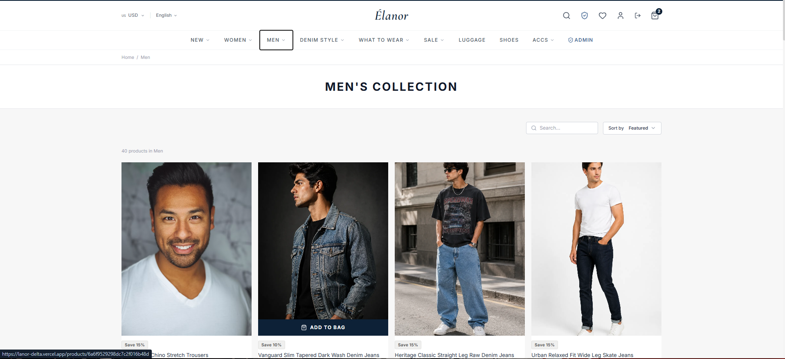
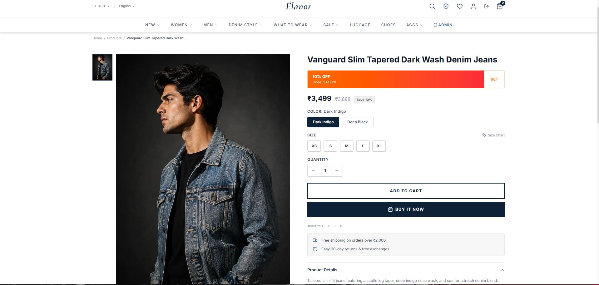
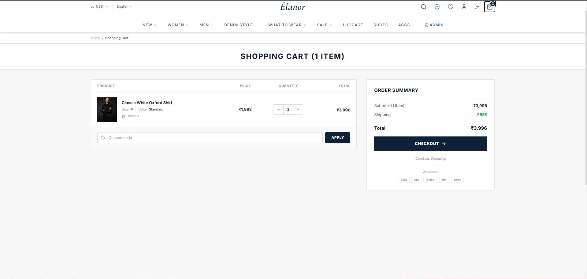
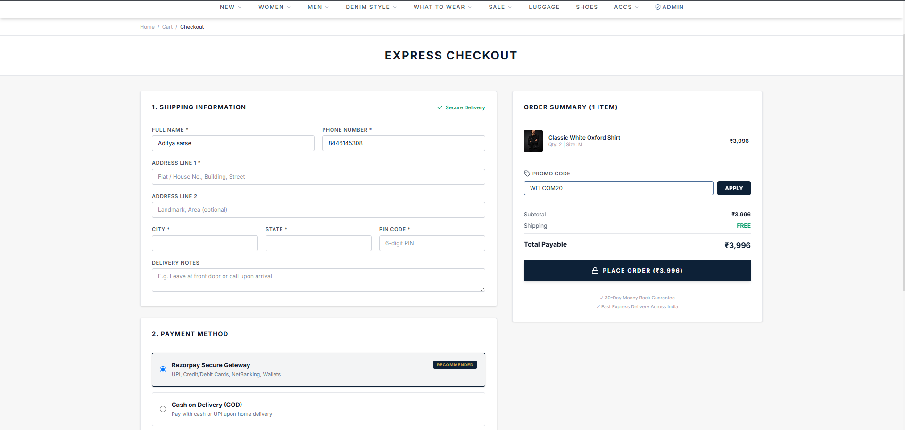
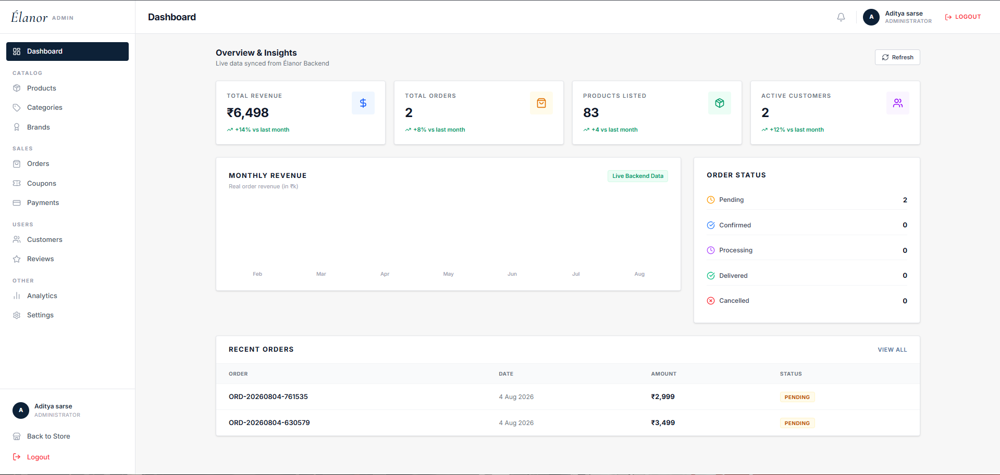
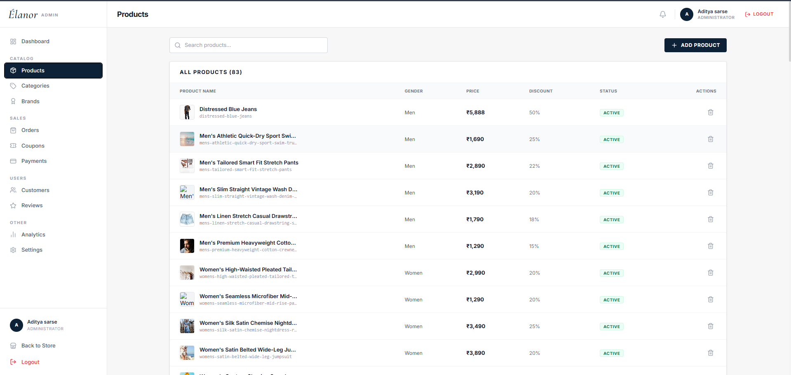
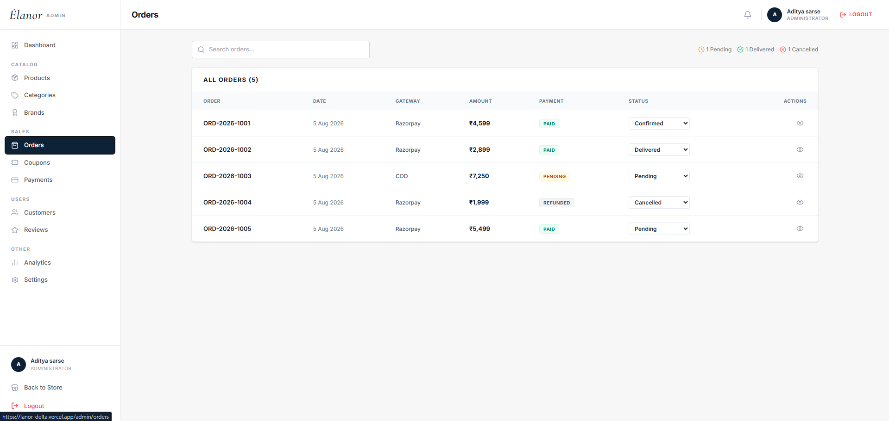

# Élanor – Luxury Fashion E-Commerce Platform

<p align="center">
  
</p>

<p align="center">
  <strong>A Modern Full-Stack Luxury Fashion E-Commerce Platform</strong><br>
  Built with the MERN Stack to deliver a premium online shopping experience with secure authentication, product management, Razorpay payments, ImageKit integration, and a powerful admin dashboard.
</p>

---

## 📖 Overview

Élanor is a production-ready luxury fashion e-commerce platform designed to provide a seamless shopping experience for customers while offering administrators complete control over products, orders, inventory, customers, and sales analytics.

The platform includes secure authentication, responsive UI, advanced product filtering, wishlist, shopping cart, Razorpay payment gateway, order tracking, and a feature-rich admin dashboard.

---

# ✨ Features

## 👤 Customer Features

- User Registration & Login
- JWT Authentication
- Secure Password Encryption
- Forgot & Reset Password
- Profile Management
- Address Management
- Browse Products
- Search Products
- Category & Brand Filters
- Price Filtering
- Wishlist
- Shopping Cart
- Coupon Support
- Razorpay Payment Integration
- Order Tracking
- Order History
- Product Reviews & Ratings
- Fully Responsive Design

---

## 🛠 Admin Features

- Secure Admin Login
- Dashboard Analytics
- Product Management
- Category Management
- Brand Management
- Customer Management
- Order Management
- Coupon Management
- Review Moderation
- Inventory Management
- Sales Analytics
- Revenue Overview
- Image Upload
- Notifications

---

# 🚀 Tech Stack

## Frontend

- React.js
- Vite
- React Router DOM
- Axios
- Tailwind CSS
- Framer Motion
- React Context API
- Lucide React

### Backend

- Node.js
- Express.js
- MongoDB
- Mongoose
- JWT Authentication
- Bcrypt
- Multer
- ImageKit SDK
- Razorpay SDK
- Nodemailer
- Cookie Parser
- CORS

### Database

- MongoDB Atlas

### Cloud Services

- ImageKit
- Razorpay
- Render
- Vercel

---

# 📂 Project Structure

```text
Elanor/
│
├── Backend/
│   ├── src/
│   │   ├── config/
│   │   ├── controllers/
│   │   ├── middlewares/
│   │   ├── models/
│   │   ├── routes/
│   │   ├── services/
│   │   ├── utils/
│   │   ├── uploads/
│   │   ├── app.js
│   │   └── server.js
│
├── Frontend/
│   ├── public/
│   ├── src/
│   │   ├── assets/
│   │   ├── components/
│   │   ├── context/
│   │   ├── hooks/
│   │   ├── layouts/
│   │   ├── pages/
│   │   ├── routes/
│   │   ├── services/
│   │   ├── utils/
│   │   └── App.jsx
│
└── README.md
```

---

# 🔐 Authentication

- JWT Access Token
- Refresh Token
- User Registration
- User Login
- Admin Login
- Protected Routes
- Role-Based Authorization
- Persistent Authentication
- Secure Logout

---

# 🛍 Product Management

- Add Products
- Edit Products
- Delete Products
- Upload Images
- Manage Variants
- Manage Sizes
- Manage Colors
- Manage Stock
- Set Discounts
- Featured Products

---

# 📦 Order Management

- Place Orders
- Order History
- Order Details
- Payment Verification
- Order Status Updates
- Cancel Orders
- Delivery Tracking

---

# ❤️ Wishlist

- Add Products
- Remove Products
- Move Products to Cart

---

# 🛒 Shopping Cart

- Add Products
- Update Quantity
- Remove Products
- Apply Coupons
- Dynamic Price Calculation

---

# 💳 Payment Gateway

Integrated with **Razorpay**

Supports:

- Secure Payments
- Payment Verification
- Order Creation
- Test Mode

---

# 🖼 Image Management

Powered by **ImageKit**

Features:

- Product Image Upload
- CDN Delivery
- Image Compression
- Optimized Images

---

# 📊 Admin Dashboard

Includes:

- Revenue Analytics
- Sales Overview
- Customer Statistics
- Product Statistics
- Recent Orders
- Inventory Monitoring

---

# 📱 Responsive Design

Optimized for:

- Desktop
- Laptop
- Tablet
- Mobile

---

# ⚡ Performance Optimizations

- Lazy Loading
- Code Splitting
- Image Optimization
- Optimized API Calls
- Efficient State Management
- Responsive Images

---

# 🌐 Deployment

| Service | Platform |
|----------|----------|
| Frontend | Vercel |
| Backend | Render |
| Database | MongoDB Atlas |
| Image Storage | ImageKit |
| Payments | Razorpay |

---

# 📸 Screenshots

## 🏠 Home Page

<p align="center">
  
</p>

---

## 🛍 Product Listing

<p align="center">
  
</p>

---

## 📄 Product Details

<p align="center">
  
</p>

---

## ❤️ Wishlist

<p align="center">
  
</p>

---

## 🛒 Shopping Cart

<p align="center">
  
</p>

---

## 💳 Checkout

<p align="center">
  
</p>

---

## 👤 User Dashboard

<p align="center">
  
</p>

---

## 🛠 Admin Dashboard

<p align="center">
  
</p>

---

## 📦 Product Management

<p align="center">
  
</p>

---

## 📑 Order Management

<p align="center">
  
</p>

---

# 📌 Future Enhancements

- AI Product Recommendations
- Recently Viewed Products
- Product Comparison
- Email Notifications
- Inventory Alerts
- Multi-language Support
- Multi-currency Support
- Advanced Analytics
- Seller Portal
- Dark Mode

---

# 👨‍💻 Developer

**Aditya Sarse**

---

## ⭐ Support

If you found this project helpful, consider giving it a **Star** on GitHub.
